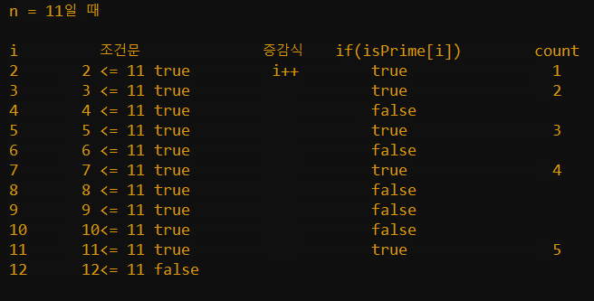

# 04. 소수 판별

* [문제 위치 : 프로그래머스](https://school.programmers.co.kr/learn/courses/30/lessons/12921)
* [자바 소스](../../../CoTeStudy/src/programmers/Test05.java)

### **문제 설명**

1부터 입력받은 숫자 n 사이에 있는 소수의 개수를 반환하는 함수, solution을 만들어 보세요.

소수는 1과 자기 자신으로만 나누어지는 수를 의미합니다.(1은 소수가 아닙니다.)

### 제한 조건

- n은 2이상 1000000이하의 자연수입니다.

### 입출력 예

| n | result |
| --- | --- |
| 10 | 4 |
| 5 | 3 |

### 입출력 예 설명

입출력 예 #11부터 10 사이의 소수는 [2,3,5,7] 4개가 존재하므로 4를 반환

입출력 예 #21부터 5 사이의 소수는 [2,3,5] 3개가 존재하므로 3를 반환

---

# ChatGPT의 도움..!!

```java
import java.util.Arrays;
class Solution {
    public int solution(int n) {
        boolean[] isPrime = new boolean[n + 1];
        Arrays.fill(isPrime, true);
        int count = 0;

        for (int i = 2; i * i < n; i++) {
            if (isPrime[i]) {
                for (int j = i * i; j <= n; j += i) {
                    isPrime[j] = false;
                }
            }
        }

        for (int i = 2; i <= n; i++) {
            if (isPrime[i]) {
                count++;
            }
        }

        return count;
    }
}
```

## 1. 사용할 변수 생성 & 초기화

```java
boolean[] isPrime = new boolean[n + 1];
Arrays.fill(isPrime, true);
int count = 0;
```

```java
- 길이가 n+1인 boolean 타입의 배열 isPrime을 만듦
	-> 배열의 인덱스와 소수인지 판별할 숫자를 알아보기 쉽게 1:1로 매칭하기 위함
- isPrime 배열을 true로 초기화함 ( 기본값 false임 )
- 소수를 카운팅 할 변수 : count
```


## 2. 2부터 i*i가 n보다 작을 때 까지 반복문 실행

```java
for (int i = 2; i * i < n; i++) {
   if (isPrime[i]) {
       for (int j = i * i; j <= n; j += i) {
           isPrime[j] = false;
       }
   }
}
```

```java
-> 내용 : 소수인지 확인해서 isPrime 배열에 반영
         -> 소수가 아니면 false 처리
            -> 소수가 아닌 조건  = 소수*소수 + 0
                               소수*소수 + 소수
                               소수*소수 + 소수
                                ...
```

이해가 잘 안가서 진행해보았습니다 🤔


## 3. 소수 개수 셈 : 2 ~ n까지 true인 값 카운팅

```java
for (int i = 2; i <= n; i++) {
		if (isPrime[i]) {
				count++;
		}
}
```

이해가 잘 안가서 진행해보았습니다2 🤔



## 느낀점

논리를 배우는게 제일 어려운것 같다

계속 읽어보고 다시 풀어보면 나도 이렇게 생각해볼 수 있게 되겠지..!!